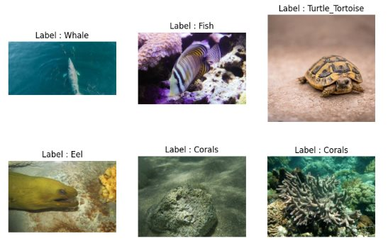
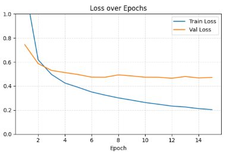
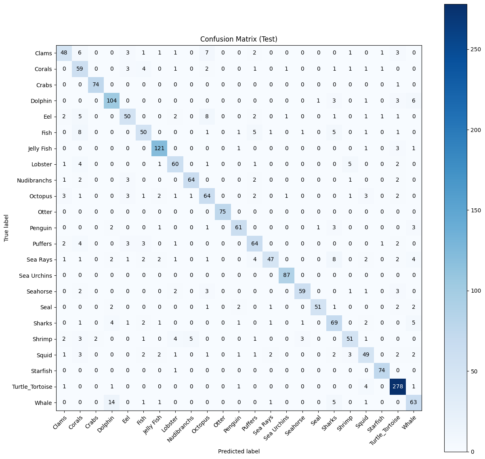

# 🐠 Sea Animals Image Classification with Deep Learning  

  

## 📌 Project Overview  
This project tackles **multi-class image classification** of sea animals using deep learning.  
The goal is to build a robust model that can correctly identify marine species such as whales, fish, turtles, eels, and corals — and evaluate performance using professional ML practices.  

The project demonstrates skills in **data preprocessing, augmentation, transfer learning, evaluation metrics, and visualization**, making it highly relevant for real-world AI applications.  

---

## 📂 Dataset  
- Contains multiple classes of sea animals (fish, whales, corals, turtles, eels, etc.).  
- Images come in varied environments, lighting conditions, and angles, making the task non-trivial.  
- Below are a few **sample images from the dataset**:  

  

---

## 🧪 Data Augmentation  
To **reduce overfitting** and **enrich the dataset**, multiple augmentation techniques were applied:  
- Random flips & rotations  
- Color jitter  
- Random cropping & resizing  
- Normalization  

These augmentations simulate real-world variability, improving the model’s ability to generalize.  

---

## 🏗️ Model Architecture  
- Built using **PyTorch**.  
- Applied **Transfer Learning** with a pre-trained **ResNet50** backbone.  
- Fine-tuned the network for sea animal classification.  
- Optimizer: **Adam**  
- Loss function: **CrossEntropyLoss** with class weighting to handle class imbalance.  

---

## 📊 Training & Evaluation  
- Training and validation were monitored over **15 epochs**.  
- Metrics tracked: **Loss** and **Accuracy**.  
- Visualization: Accuracy/Loss curves, Confusion Matrix, and performance plots.  

**Loss over Epochs:**  
  

**Confusion Matrix (Test):**  
  

This matrix highlights model strengths (high diagonal values) and weaknesses (off-diagonal errors), providing deep insights into classification mistakes.  

---

## ✅ Results  
- Achieved strong classification performance across multiple marine categories.  
- Transfer Learning proved effective in adapting a generic model to a marine-specific dataset.  
- The confusion matrix and validation curves indicate stable training with minimal overfitting.  

---

## 🚀 Key Takeaways  
- Hands-on experience in **Computer Vision** and **Deep Learning**.  
- Built a complete pipeline: **data preprocessing → training → evaluation → visualization**.  
- Strong use of **PyTorch, Transfer Learning, and model monitoring**.  
- Project showcases **ML best practices** (augmentation, validation, tracking, model checkpointing).  

